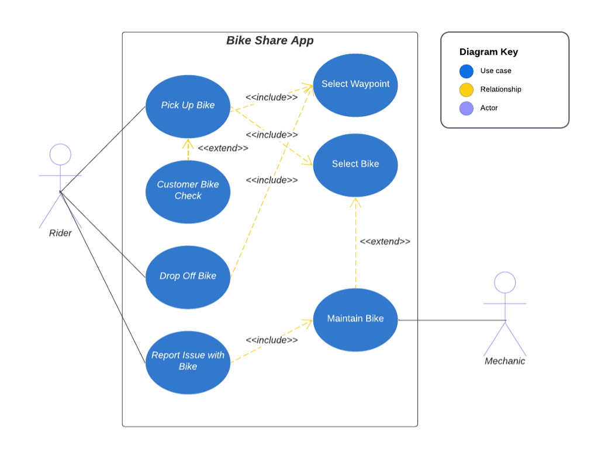

# Community Bike-share System
## Bike share project for MSSE670
_Please scroll to the bottom to see proof of the app running week by week_

## About the App
This application provides the basic services for a small community to standup a basic bike share program. It works a lot like a public library, but with bikes. The idea is that a bike store(s) would sponsor the program by providing older, but still functional, bikes for riders to check-out. There are various locations (called waypoints in the system) where bikes can be checked out from and returned to. Anyone can sign up and check-out a bike, but can only have one bike out at a time. The sponsoring bike shop(s) is/are responsible for the maintenance of the bikes to make sure they are in good working order.  This application enables this basic functionality of allowing riders to check-out/check-in bikes as well as helping the sponsors with tracking their locations and performing maintenance. 

## Use Case Diagram

### The app running for week 4:

### The app running for week 4:
